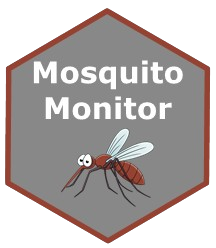

# Mosquito Monitor  

 
  

The City of Winnipeg and City of Brandon have stopped conducting mosquito surveillance. This project will be active again in spring of 2025. 

I developed an [automated workflow](https://github.com/colebaril/Mosquito_Monitor/blob/main/.github/workflows/) and [Shiny App](https://colewb.shinyapps.io/Mosquito_Monitor/) that, in conjunction, collects mosquito trap data from government sources, stores historical data, and displays data in a digestable format. Historical data for the City of Brandon, City of Winnipeg and Western Manitoba will be displayed in addition to daily updates on City of Winnipeg and City of Brandon trap counts. When the data is updated, a Tweet is sent from the [Mosquito Monitor Twitter Account](https://twitter.com/MosquitoMonitor). 

# Updates

## Version 0.0.4

- Identified a bug that causes the figure to be updated before the updated data is committed to the repository, resulting in old data being tweeted. This is likely due to how GitHub Actions handles triggers via commits
   - Added wait times such that the data is up-to-date by the time the scripts to update figures and Tweet runs
- Added a workflow to include City of Brandon mosquito trap counts in both the Shiny application as well as the Twitter account notifications

## Version 0.0.3

- Changed y axis trans to `log1p` for the faceted Winnipeg plots to better display the poisson-like mosquito trap count distributions
- Implemented a Twitter Bot using Python that sends a Tweet with the city map when the data has been updated

## Version 0.0.2

- Introduced a map of Winnipeg displaying the number of specimens caught in each zone separated by Forward Sortation Area
- Introduced comparable weather data along with City of Winnipeg historical trapping data (e.g., temperature, precipitation)

# Known Issues

1. The R3C (Broadway / The Forks / Portage and Main) Forward Sortation Area (FSA) includes geometry for Northwest Winnipeg, out of city limits, with a land area of 143 square kilometres. If the R3C FSA is included in the colour scale, a large portion outside the city is also coloured and distorts the map. Thus, this FSA in the city map is not coloured. A ticket has been sent to Statistics Canada.

# Citing This Repository

Baril, Cole. (2024). _Mosquito Monitor: An Automated Workflow and Shiny App for Mosquito Trap Data Collection and Visualization_ [Repository]. GitHub. https://github.com/colebaril/Mosquito_Monitor

# GitHub Actions

This repository and Shiny app relies on various automated GitHub Actions workflows:

1. **Scrape Data**: Checks the City of Winnipeg Insect Control website once per hour for updates. If an update is found, the data is pushed to the `main` branch in this repository as `mosquito_data.csv`. This [Shiny App](https://colewb.shinyapps.io/Mosquito_Monitor/) `mosquito_data.csv` to display data. For the Brandon variant, it retrieves data from the City of Brandon API. 
   
2. **Update Figure**: When `mosquito_data.csv` is changed in the `main` branch, a new figure, `wpg_mosquito_map_tmp.png`, is pushed to the `main` repository in this branch. For the Brandon variant, a table containing the five trap counts is generated.
   
3. **Tweet Update**: When `wpg_mosquito_map_tmp.png` is changed in the `main` branch, a Tweet is sent via [Tweepy](https://www.tweepy.org/) and `tweet_mosquito_update.py` by the [Mosquito Monitor Twitter Account](https://twitter.com/MosquitoMonitor) with the date the data was updated as well as the Forward Sortation Area (FSA) Boundary map of Winnipeg with FSAs filled with the number of mosquitoes collected. For the Brandon variant, the table is tweeted.

# Shiny App 

A shiny app reads the `mosquito_data.csv` (`mosquito_data_bdn.csv` for Brandon) file remotely and displays summary tables, figures and downloadable data. Weather data was obtained from [Environment and Climate Change Canada's Winnipeg A CS Weather Station](https://climate.weather.gc.ca/climate_data/hourly_data_e.html?hlyRange=2013-12-10%7C2024-05-26&dlyRange=1996-10-01%7C2024-05-26&mlyRange=1996-10-01%7C2007-11-01&StationID=27174&Prov=MB&urlExtension=_e.html&searchType=stnName&optLimit=yearRange&StartYear=1840&EndYear=2024&selRowPerPage=25&Line=0&searchMethod=contains&Month=5&Day=26&txtStationName=Winnipeg&timeframe=1&Year=2024) using the [weathercan package](https://github.com/ropensci/weathercan). The map of Winnipeg was constructed using data obtained from [Statistics Canada Boundary Files](https://www12.statcan.gc.ca/census-recensement/2021/geo/sip-pis/boundary-limites/index2021-eng.cfm?Year=21) and the [sf package](https://cran.r-project.org/web/packages/sf/index.html). 

# Disclaimer

This application is not affiliated with, endorsed by, or sponsored by the City of Winnipeg, City of Brandon, or Government of Manitoba. All data utilized in this application is obtained from publicly available sources provided by the City of Winnipeg, City of Brandon and Manitoba Government. The creators of this application do not claim ownership of the data provided by the City of Winnipeg, City of Brandon or the Manitoba Government and do not assume responsibility for the accuracy or completeness of the data. Users of this application should verify any information obtained from this application with official sources.

# Data

The City of Brandon and City of Winnipeg publishes their historical data annually on their websites. The Manitoba Government does not post any historical trapping data for provincial traps on their website, only the number of *Culex tarsalis* specimens identified. If you have any sources of data you wish to contribute, please email me at colebarilca@gmail.com. 

# References 

Baril, C., Pilling, B.G., Mikkelsen, M.J. et al. The influence of weather on the population dynamics of common mosquito vector species in the Canadian Prairies. _Parasites Vectors 16_, 153 (2023). <https://doi.org/10.1186/s13071-023-05760-x>. 

City of Winnipeg (2024). _Nuisance Mosquito Trap Counts_. <https://legacy.winnipeg.ca/publicworks/insectcontrol/mosquitoes/trapcounts.stm>.

City of Brandon (2024). _Mosquito Abatement Program_. <https://brandon.ca/mosquito-abatement/mosquito-abatement-program>. 

Environment and Climate Change Canada (2024). _WINNIPEG A CS Weather Station_. <https://climate.weather.gc.ca/climate_data/>. 

R Core Team (2023). _R: A Language and Environment for Statistical Computing_. R Foundation for Statistical Computing, Vienna, Austria.
<https://www.R-project.org/>.

Python Software Foundation. (2024). _Python Language Reference, version 3.10_. Available at https://www.python.org.

Wickham H, Averick M, Bryan J, Chang W, McGowan LD, François R, Grolemund G, Hayes A, Henry L, Hester J, Kuhn M, Pedersen TL, Miller E, Bache
SM, Müller K, Ooms J, Robinson D, Seidel DP, Spinu V, Takahashi K, Vaughan D, Wilke C, Woo K, Yutani H (2019). “Welcome to the tidyverse.”
_Journal of Open Source Software_, *4*(43), 1686. doi:10.21105/joss.01686 <https://doi.org/10.21105/joss.01686>.

Wickham H (2024). _rvest: Easily Harvest (Scrape) Web Pages_. R package version 1.0.4, <https://CRAN.R-project.org/package=rvest>.

Chang W, Cheng J, Allaire J, Sievert C, Schloerke B, Xie Y, Allen J, McPherson J, Dipert A, Borges B (2023). _shiny: Web Application Framework
for R_. R package version 1.8.0, <https://CRAN.R-project.org/package=shiny>.

Pebesma E, Bivand R (2023). _Spatial Data Science: With applications in R_. Chapman and Hall/CRC. doi:10.1201/9780429459016
<https://doi.org/10.1201/9780429459016>, <https://r-spatial.org/book/>.

LaZerte S, Albers S (2018). “weathercan: Download and format weather data from Environment and Climate Change Canada.” _The Journal of Open Source Software_,
*3*(22), 571. <https://joss.theoj.org/papers/10.21105/joss.00571>.

Firke S (2023). _janitor: Simple Tools for Examining and Cleaning Dirty Data_. R package version 2.2.0,
<https://CRAN.R-project.org/package=janitor>.

Grolemund G, Wickham H (2011). “Dates and Times Made Easy with lubridate.” _Journal of Statistical Software_, *40*(3), 1-25.
<https://www.jstatsoft.org/v40/i03/>.

Xie Y, Cheng J, Tan X (2023). _DT: A Wrapper of the JavaScript Library 'DataTables'_. R package version 0.31,
<https://CRAN.R-project.org/package=DT>.

Chang W (2021). _shinythemes: Themes for Shiny_. R package version 1.2.0, <https://CRAN.R-project.org/package=shinythemes>.

Roesslein, Joshua. (2024). *Tweepy: Twitter for Python!* Available at https://www.tweepy.org.

Reitz, Kenneth, & Chisom, Cory. (2024). *Requests: HTTP for Humans* [Software]. Available at https://docs.python-requests.org/en/latest/.

